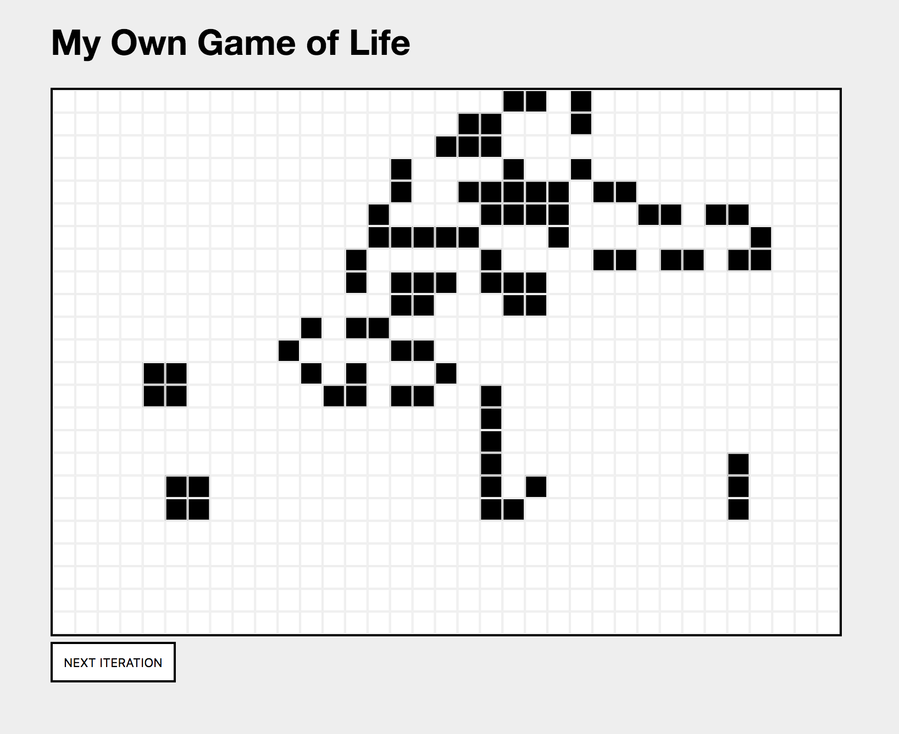

# Interview Question IGG

You're building a [cellular automata simulator](https://en.wikipedia.org/wiki/Cellular_automaton). In particular you are building one for Game Of Life.

A cellular automata is defined as:
Given a board with m by n cells, each cell has an initial state live (1) or dead (0).
Each cell interacts with its eight neighbors (horizontal, vertical, diagonal).

Game of life is defined with these rules:

1. Any live cell with fewer than two live neighbors dies, as if caused by under-population.
2. Any live cell with two or three live neighbors lives on to the next generation.
3. Any live cell with more than three live neighbors dies, as if by over-population.
4. Any dead cell with exactly three live neighbors becomes a live cell, as if by reproduction.

## Setup

You extend a non working version of Game Of Life we provide you, to make it work on your machine, follow the steps:

1. Make sure you have an up to date node version with npm and execute `npm install` in this directory.
2. Execute `npm start` to compile the project, it is now served at [http://localhost:3000/](http://localhost:3000/).
3. Changes can be made in `src/index.js`. You can also add additional files etc.

We already decided which technologies to use for this project, mainly React, styled-components and webpack with babel. The provided codebase should offer enough examples on how to use them in the most basic way.

## Your task

1. Change the `createBoard` method to randomly set `false`/`true` for each cell.
2. Implement the `setAlive` method, which sets a cell to true. It should be shown as black, when functional.
3. Make the Game Of Life simulator functional by implementing the `getNeighbours` and `step` function.
4. Make it possible, that one can actually draw the cells, instead of clicking on each of them. In other words: when you keep pressing the mouse button and move it, all fields below the mouse will turn alive.
5. Implement a _PLAY_ and _PAUSE_ button. When the play button is active, a new iteration should be created every 200ms.
6. Bonus (optional): Implement a history, which you can access using a _PREVIOUS ITERATION_ Button. The current iteration should be shown using a counter somewhere.

## Questions to consider

1. Why did we use dom for rendering instead of canvas 2d / webgl? What are the pros/cons for each?
2. How would you go to create a general purpose cellular automata? (How to make the rules adjustable)
3. Did it make sense to build with React? What were problems in comparison to vanilla JS?
